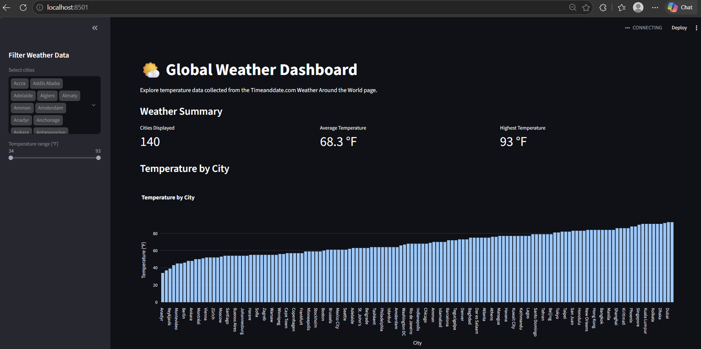

# Global Weather Web Scraping Project

This project uses Selenium to scrape current weather data from the Timeanddate.com "Weather Around the World" page. The data is cleaned with Pandas, stored in a SQLite database, and displayed in an interactive Streamlit dashboard.

## Data Collected

The scraper collects weather data for approximately 140 cities:

- City
- Day
- Local time
- Temperature in Fahrenheit

The scraped data is loaded into a Pandas DataFrame and saved to CSV.

## Data Cleaning

Pandas is used to:

- Remove duplicate records
- Remove missing values
- Store temperature as numeric data
- Display the data before and after cleaning

## Database

SQLite is used to store the weather data in two tables:

- `weather_raw` - Raw scraped weather data
- `weather_cleaned` - Cleaned weather data used by the dashboard

## Streamlit Dashboard

The Streamlit dashboard includes:

- Temperature by city
- Temperature distribution
- City temperature comparison
- Summary weather metrics
- City selection filter
- Temperature range slider

The visualizations automatically update based on the selected filters.

## Files

- `weather_scraper.py` - Web scraping and data cleaning
- `weather_database.py` - SQLite database creation
- `streamlit_app.py` - Interactive Streamlit dashboard
- `weather_raw.csv` - Raw weather data
- `weather_cleaned.csv` - Cleaned weather data
- `weather.db` - SQLite database
- `requirements.txt` - Project dependencies

## Setup

Install the required packages:

```bash
pip install -r requirements.txt
```

Run the weather scraper:

```bash
python weather_scraper.py
```

Create/update the SQLite database:

```bash
python weather_database.py
```

Run the Streamlit dashboard locally:

```bash
streamlit run streamlit_app.py
```

## Dashboard Screenshot

